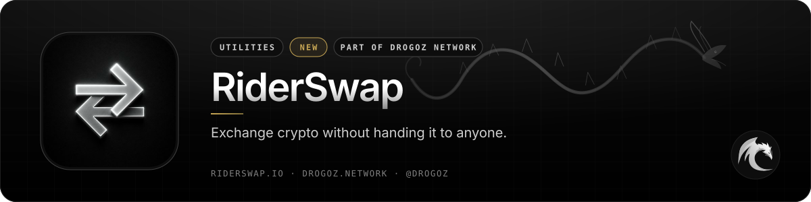
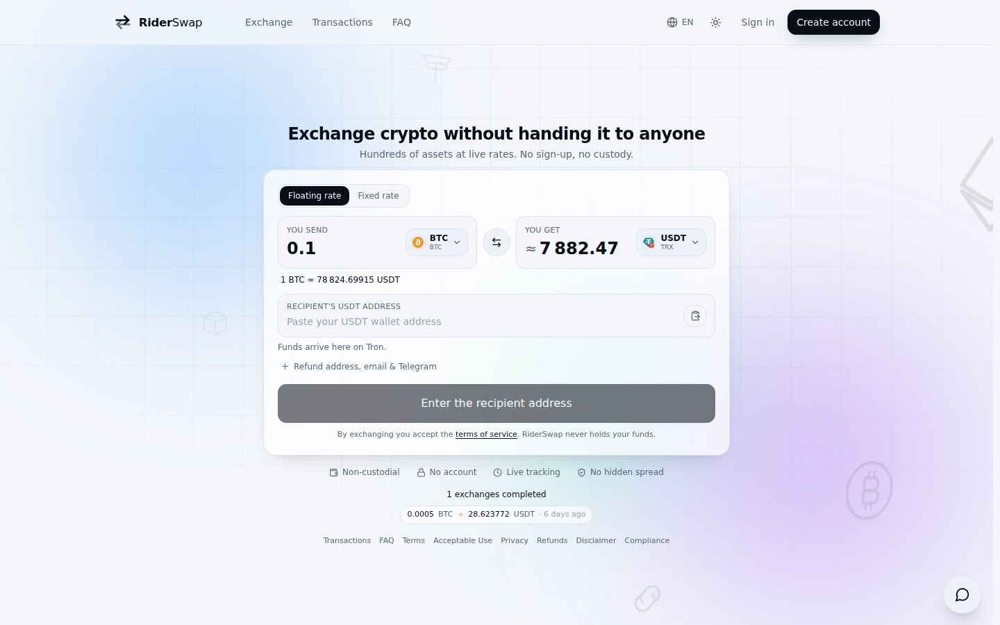
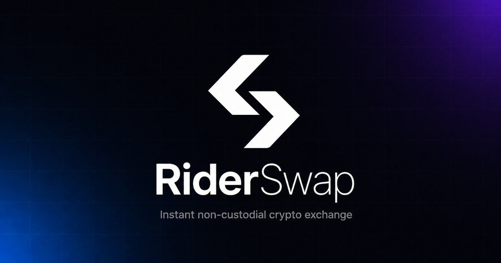
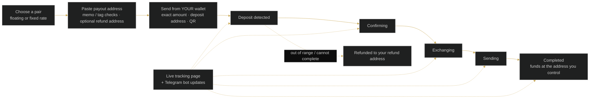

 

# RiderSwap

### Exchange crypto without handing it to anyone.

 

  

 

## 📋 Table of contents

- [Overview](#-overview)
- [Key features](#-key-features)
- [Screenshots](#-screenshots)
- [How it works](#%EF%B8%8F-how-it-works)
- [Use cases](#-use-cases)
- [Pricing](#-pricing)
- [Free live demonstration](#-free-live-demonstration)
- [Links](#-links)

## 🧭 Overview

RiderSwap is a non-custodial cryptocurrency exchange. You choose what to send and what to receive, you send from a wallet you control, and the proceeds arrive at an address you name. RiderSwap never holds your funds, never signs a blockchain transaction, and never asks for a private key or a seed phrase. There is nothing to deposit with us and nothing to withdraw from us.

No account is required — the exchange works in the browser. The catalogue covers hundreds of assets (900+) across major networks at live rates. RiderSwap quotes the best rates on the market with no hidden spread: the amount shown before you confirm is the amount the quote is built from, and network fees are shown separately.

Every exchange has its own live tracking page and RiderSwap runs its own Telegram bots in live mode, so every status change — created, awaiting deposit, deposit detected, confirming, exchanging, sending, completed, refunded, expired or action required — is seen the moment it happens. The interface is available in English, Russian, Spanish, German, Turkish and Georgian, with dark and light themes.

<table>
<tr>
<td align="center" width="25%"><b>Category</b> Utilities</td>
<td align="center" width="25%"><b>Status</b> New</td>
<td align="center" width="25%"><b>Bundle</b> Utilities (−2%)</td>
<td align="center" width="25%"><b>Pricing</b> Custom pricing</td>
</tr>
</table>

## ✨ Key features

### 🔐 Non-custodial by design

- **We never take custody** — your coins move from your wallet to the destination you set. No private key, no seed phrase, nothing to deposit or withdraw.
- **No account required** — open the site, choose the pair, paste your payout address and go. An account is optional and only keeps your history together across devices.
- **Address checks before you send** — memo and tag support on networks that need them, with a clear warning if one is missing.
- **Optional refund address** — if an exchange cannot complete or the amount is out of range, funds return to you automatically.

### 💱 Rates & assets

- **Hundreds of assets, live rates** — 900+ cryptocurrencies across major networks.
- **No hidden spread** — the best rates on the market, shown before you confirm; network fees shown separately.
- **Floating or fixed rate** — floating follows the market until your deposit confirms (default, usually cheaper); fixed locks the amount for a short window.
- **Fast settlement** — most exchanges complete in five to thirty minutes, most of it waiting for network confirmations.

### 📡 Tracking & support

- **Live tracking page** for every exchange — deposit detected → confirming → exchanging → payout sent. Works later from any browser with the link.
- **Telegram bots in live mode** — attach Telegram to a swap and get the same live updates in chat.
- **Transaction page** — exact amount to send, deposit address, QR code, payout address, rate type and live timeline; one-tap copy and block-explorer links.
- **In-page support chat** already linked to the exchange; look up any transaction by ID.

### 🌍 Interface

- **Six languages** — English, Russian, Spanish, German, Turkish and Georgian.
- **Dark and light themes.**
- **Optional email updates** about that exchange only — no marketing.

## 🖼️ Screenshots

> Product images from [riderswap.io](https://riderswap.io/) and the [service page](https://drogoz.network/services/riderswap/) on drogoz.network.

<table>
<tr>
<td width="50%" align="center"> RiderSwap — Exchange crypto without handing it to anyone</td>
<td width="50%" align="center"> RiderSwap — instant non-custodial crypto exchange</td>
</tr>
</table>

## ⚙️ How it works

**From pair to payout — without custody**

## 🎯 Use cases

<table>
<tr>
<td width="50%" valign="top"><b>👤 Private individuals</b> Swap without sign-up — nothing to deposit, nothing to withdraw, no custody.</td>
<td width="50%" valign="top"><b>🏢 Treasury & operations teams</b> Fixed-rate quotes when the number must stay still; a tracking link that works from any browser.</td>
</tr>
<tr>
<td width="50%" valign="top"><b>🌐 Multilingual users</b> Six interface languages, including Georgian, with dark and light themes.</td>
<td width="50%" valign="top"><b>🔔 Always-on monitoring</b> Telegram bot updates the moment an exchange changes state — no need to stay on the site.</td>
</tr>
</table>

## 💳 Pricing

> **Sign in at [drogoz.network](https://drogoz.network/accounts/login/) to see pricing.** *Custom pricing:* Request a demo and we'll tailor an offer to you.

RiderSwap is part of the **Utilities** bundle (−2%) — *Core utility tools* — and of **All In One** (−10%) — *Every product, best price*. Take several products together and save more: [Packages & bundles](https://drogoz.network/#packages) · [Pricing & calculator](https://drogoz.network/pricing/).

| Bundle | Discount | Included |
|---|---|---|
| **Utilities** | −2% | Drog AI, MyMask AI, Replika, IMPERATORI, RiderSwap, Vadira, Skriper |
| **All In One** | −10% | Drog AI, MyMask AI, Replika, Lidaro AI, IMPERATORI, ZOI Talks, RiderSwap, HyperBlast AI, VerifHub AI, Vadira, Skriper |

## 🎥 Free live demonstration

**A live demonstration is 100% free on every product.** 
See RiderSwap in action before you pay — our agent gets in touch and walks you through a live demonstration.

Registration is handled by our team — get in touch and receive personal access.

## 🔗 Links

| Channel | Link |
|---|---|
| 🌐 **Website** | [riderswap.io](https://riderswap.io/) |
| 📄 **Details page** | [drogoz.network/services/riderswap/](https://drogoz.network/services/riderswap/) |
| ✈️ **Telegram** | [@drogoz](https://t.me/drogoz) |
| 🏛️ **Drogoz Network** | [drogoz.network](https://drogoz.network) · [Services](https://drogoz.network/#services) · [Packages](https://drogoz.network/#packages) · [Pricing](https://drogoz.network/pricing/) · [Presentation](https://drogoz.network/presentation/) |
| ⚖️ **Legal** | [Terms of Service](https://drogoz.network/legal/terms-of-service/) · [Acceptable Use](https://drogoz.network/legal/acceptable-use-policy/) · [Privacy](https://drogoz.network/legal/privacy-policy/) · [Refunds](https://drogoz.network/legal/refund-policy/) · [Disclaimer](https://drogoz.network/legal/disclaimer/) · [Compliance](https://drogoz.network/legal/compliance-policy/) |
| 🐙 **GitHub** | [deepdrogo](https://github.com/deepdrogo/deepdrogo) |

 

   
  
    
  <b>Made by <a href="https://drogoz.network">Drogoz Network</a></b> 
  One network — all your services · Premium SaaS Network
    
  
  
  
  
    
  <b>More from the network:</b> <a href="https://github.com/deepdrogo/drog-ai">Drog AI</a> · <a href="https://github.com/deepdrogo/mymask-ai">MyMask AI</a> · <a href="https://github.com/deepdrogo/replika">Replika</a> · <a href="https://github.com/deepdrogo/lidaro-ai">Lidaro AI</a> · <a href="https://github.com/deepdrogo/imperatori">IMPERATORI</a> · <a href="https://github.com/deepdrogo/zoi-talks">ZOI Talks</a> · <a href="https://github.com/deepdrogo/hyperblast-ai">HyperBlast AI</a> · <a href="https://github.com/deepdrogo/verifhub-ai">VerifHub AI</a> · <a href="https://github.com/deepdrogo/vadira-net">Vadira</a> · <a href="https://github.com/deepdrogo/skriper-io">Skriper</a> · <a href="https://github.com/deepdrogo/mytasker">MyTasker</a> · <a href="https://github.com/deepdrogo/mamont-tech">Mamont</a> · <a href="https://github.com/deepdrogo/drogscan">DrogScan</a>
    
  © 2026 Drogoz Network. All rights reserved. Provided strictly for lawful use — see the <a href="https://drogoz.network/legal/">Legal Center</a>. Each user is solely responsible for how they use the software.

